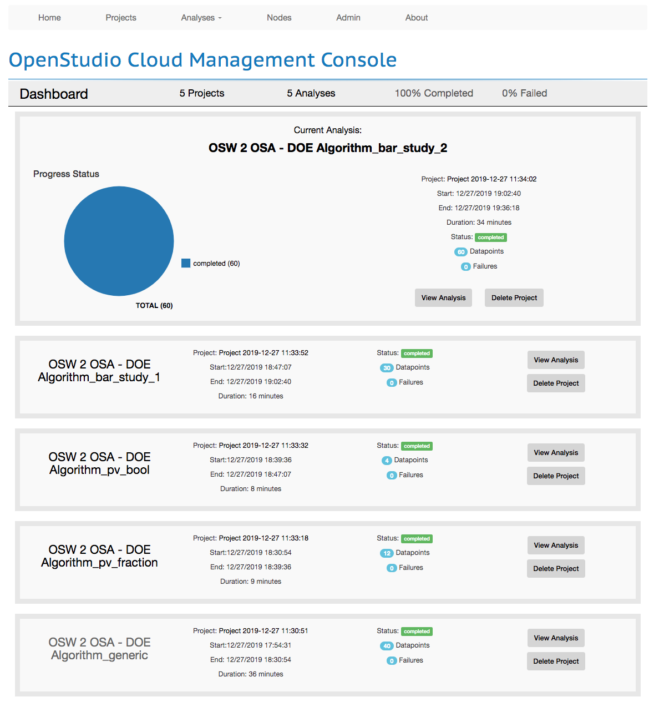
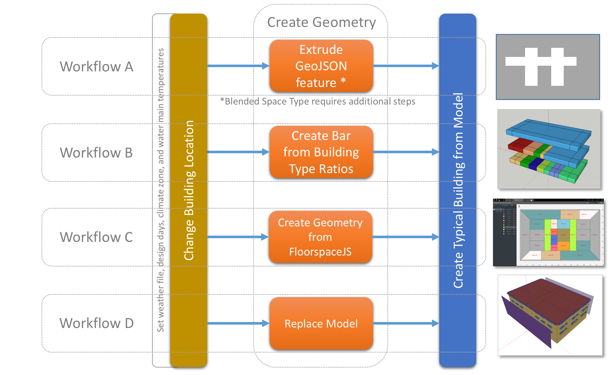

# osw2osa
This repo is a sample deployment of ruby scripts used to generate OSA files from template OSW and OSA files. It uses bundle to access measure from measure gem repositories so you don't have to check out any other GitHub repositories to use this one. OSW files can be run for testing prior to generating and running OSA projects. Rake tasks should be the primary interfaces for users of this repository. Additionally new OSW and OSA templates can be add without having to alter ruby code. If you want to setup new variable sets you will need to edut `custom_var_set_mapping.rb`. `osw_2_osa.rb` contains more generalized code that shouldn't be project specific. . This creates the analysis JSON file as well as the ZIP file containing measures, weather, seed models, analysis scripts, and other resources. The script supports defining variable values for measure arguments found in the template OSW file. You can run the script with a clean checkout (of required repositories) by calling `ruby osw_2_osa_rb` from the top level of this repository. This will populate the run directory with a JSON and ZIp file for the default analysis described in 'custom_var_set_mappping.rb'

- Instructions
    - Requires Ruby 2.5.5.
    - Requires OpenStudio 3.0.x
    - install bundle using `gem install bundle` at the command prompt
    - from top level of repository type `bundle install` at the command prompt
       - This should result in a `.bundle` directory which contains all of the measure gems necessary for the workflows described in this repository. Any measures that are not in a measure gems and are unique to this project can be in the `measures` directory at the top level of the repository.
       - Do not add altered copies of measures from other repositories in this repositories `measures` directory. Instead alter the `Gemfile` for the branch of the measure gem repository that has the desired version of the measure.
    - Most functionality is via Rake tasks. At the command prompt type `bundle exec rake -T` to see a list of functions; some of which are described below. When calling any tasks use `bundle exec rake task_name`. Some tasks take an argument `bundle exec rake task_name[args]`.
        - rake clear_run                                                    # Delete contents under run directory
        - rake find_bundle_measure_paths                                    # Find Bundle measure paths to add to bundle osws
        - rake find_osws                                                    # List OSW files in the measures workflows directory
        - rake run_all_osws                                                 # Run all osws
        - rake run_osw[workflow_name,measures_only]                         # Run single osw
        - rake setup_all_osws                                               # Setup all osw files to use bundler gems for measure paths
        - rake setup_non_gem_measures                                       # setup additional measures that are not measure gems as if they were installed with bundle install
        - rake setup_osa[json_bool,zip_bool,var_set,select_osw,select_osa]  # Setup an analysis including zip file and OSA (can run with all defaults
        - rake setup_osw[workflow_name]                                     # Setup single osw file to use bundler gems for measure paths
        - rake setup_run_osw[workflow_name]                                 # Setup and run single osw
    - Typical chronology Rake tasks are used in.
        - `setup_osw` makes a copy of one of the OSW files from the `workflows` directory into the `run/workflows` directory. measure paths are adjusted to use the measure gems that are nested deep under `.bundle` when you run bundle install.
        - `run_osw` will run the OSW file in the `run/workflows` directory. For testing you can run quicker variation that runs the measures but not EnergyPlus
        - Once you have a single datapoint running and are ready to run a parametric analysis you can use `setup_osa` to generate the analysis OSA file and zip file.
        - Currently you need to run the meta-cli to send the analysis to an already running OpenStudio server. In the future additional Rake tasks may support this.
        - When you no longer want to keep run files  calling the `clear_run` Rake tasks will delete the `run` directory and all files underneath it. Even if you do not clear this out the `.gitignore` file will be setup to exclude these files from the repository. If you want to alter or make new OSW files, changes should be made in the `workflows` directory at the top level of the repository, not in `run/workflows`.
        - If your command line doesn't accept rake arguments then try adding a `\` before the open anc closing bracket or and `unsetopt nomatch` to the `.zshrc` file in your user account.
- Repository File Structure
    - workflows
        - This contains OSW files that can be run as single datapoints, or used with `osw_2_osa.rb` to setup one or multiple OSA files. Note that this repository was originally setup with measure repos checked out alongside this repository. The measure paths reflect that and can be run as is if the additional repositories are checked out and in the proper location. Generally however OSW's should be setup in the run directory to use measure gems installed by `bundle install`
        - bar_typical (geometry from high level inputs)
        - floorspace_typical (geometry from 2d FloorSpaceJS)
        - osm_typical (geometry from OSM)
        - mixed_use_multifamily (requires additional non-gem measures setup by setup_non_gem_measures rake task)
        - bar_typical_split (test running two instances of create_typical with HVAC in the second instance)
        - blend_typical (uses geojson footprint with blended space type requires additional gems in CLI call, not setup to run yet.)
        - merge_models (not currently functional, may be removed from here)
        - merge_models_not_geo (not currently functional, may be removed from here)
    - measures
        - You would generally use this for single purpose measures that don't exist in another repository and that you don't think will be useful outside of the current project you are setting up.
    - weather
        - Contains weather files that are used by OSW, OSA, or by measures such as the `ChangeBuildingLocaiton` which requires additional EPW, DDY, and STAT files.
    - seeds
        - Seed models that will be used by one or more of the template OSW files and the resulting OSA files.
    - files
        - This contains files that are be used by measures when an OSW or OSA is run. This includes `geojson` and `FloorspaceJS` json files, but may also include any file needed by a measure that isn't already contained within the measure.
    - GemFile
        - Defines which Ruby gems will be installed by `bundle install`
    - `.bundle`
        - config file defines where `bundle install` will be placed (only on local checkout)
        -   This location is defined at `.bundle/install/ruby/2.5.0/bundler/gems/`.
    - Rakefile
        - After running bundle install this rake file can be may interface to use this repository. It can setup or run OSW files and can setup OpenStudio Analyses (zip and OSA file). It can also clear the run directory.
    - osw_2_osa.rb
        - This script is the primary file for the repository that everything else supports. The script arguments are described later in this readme. This is currently just setup for discrete variables, but could support more in the future.
    - custom_var_set_mapping.rb
        - This is called by `osw_2_osa.rb` to identify the mapping for variables, OSA template, and the source OSW.
        - Methods in script
            - `valid_var_sets` is just basic error handling to look for unexpected arguments passed in for argument in main script
            - `selected_var_set` determines the default variable set to use if argument is not passed in. For basic use cases with one one primary analysis this makes calling the script cleaner.
            - `select_osw` is used to pick the template OSW based on the `var_set` unless the user specifically enters an argument for a specific template OSW.
            - `select_osa` is used pick the template OSA if an argument for this isn't passed in by the user.
            - `var_mapping` sets up discrete variables in the final OSA. This can be enhanced in the future to support other variable types.
            - `update_static_arg_val` can be used to alter static argument values for a specific analysis. This can be used to change a default value from what is in an OSW, or can be used to skip measures in an OSW by making use of the `__SKIP__` argument and setting it it `true`. This allows you to get more use out of a smaller number of OSW files which is easier ot maintain as you make chagnes or add reports.
    - template_osa_files
        - The template OSA files are used for their output variables, objective functions, algorithm settings, and their server scripts. 
        - If the template OSW has defined a seed model and weather file, it will be used in place of what is in the template OSA. 
        - The template OSA should have an empty `workflow` heading under the problem. That will be populated by `osw_2_osa` based on the template OSW and the variable logic in the script.
        - Current templates use design of experiments algorithm (DOE) and SingleRun, but other algorithms can be added.
    - analysis_scripts
        - This contains an example worker initialization script that installs a custom version of the `openstudio-standards` gem for an analysis.
    - run (only on local checkout)
        - workflows
            - When you run rake tasks to setup OSW files they are copied here, but with measure paths updated to use the measures installed by bunlder
        - analyses
            - after you run 'osw_2_osa.rb' this directory will be generated and populated with analysis JSON files and an analysis zip file. These are what are required by the OpenStudio meta-CLI to run an analysis.
    - docs
        - This just contains image files embedded in this readme file.
- `osw_2_osa.rb` Arguments
    - ARGV[0] json file is generated unless false. Default value is true.
    - ARGV[1] zip file is generated unless false. Default value is true.
    - ARGV[2] variable set name. Default value is `generic`. Other example variable sets are listed below. These are defined by the `custom_var_set_mapper.rb` file.
        - generic (uses bar_typical)
        - pv_fraction (uses floorspace_typical)
        - pv_bool (uses floorspace_typical)
        - bar_study_1 (uses bar_typical)
        - bar_study_2 (uses bar_typical)
        - *blend_typical (uses blend_typical)
        - *blend_skip_true (use blend_typical but skip blend and urban geometry measures)
        - *(Not working yet in OSA, measure requires files from repo outside of the measure)
    - ARGV[3] parent directory name for source osw (can also be picked based on analysis name in ARGV[3]). Default varies based on variable set. Currently the expected OSW name is `in.osw` within the selected directory.
    - ARG[4] file name for template osa. Default value is `osa_template_doe`.
    - An example call with arguments would be `ruby osw_2_osa.rb true true pv_fraction bar_typical_split osa_template_single_run`
- Testing
    - Tested using develop checkout of source repositories as of 12/26 using OpenStudio 2.9.0. Tested local OSW runs, and OpenStudio Server based OSA runs.
- Future code development tasks
    - Update to use 3.1.0 version of measures and test
    - Change where bundle installs gems to be shorter path
    - Figure out how to get OSA to work with `runner.workflow.FindPath` instead having to set relative path for use with OSA, while it seems the path is wrong for OSW run, extra file paths are added into OSW when it is run.
    - get ServerDirectoryCleanup on public repo and put in OSW with flat to skip in `custom_var_set_mapping`. Note that it doesn't always clean up sizing run, need to make it more robust.
    - once using newer openstudio_results that adds runner.registerValue for reported climate zone (not just argument value) add that to output of template OSA files. It makes graphics much easier than using weather file name.
- Legacy Workflow: None of these repositories are needed when using bundle and the rake tasks to run OSW's and setup OSAs. When running the OSW files in the repository directly additional repositories need to be checked out. These repositories contain most of the measured used by the workflow. The paths in OSW assume these repositories are checked out next to the osw2osa repository. The legacy workflow for setting up OSA's is not supported now as it looks in the `run\workflows\` directory for template OSW files and not the `workflows` directory. If someone needs to do this it wouldn't be hard to setup a new argument or variable for template workflows path vs. hard coded it.
    - https://github.com/NREL/openstudio-model-articulation-gem/tree/develop
    - https://github.com/NREL/openstudio-common-measures-gem/tree/develop
    - https://github.com/urbanopt/urbanopt-geojson-gem/tree/develop
    
Run Individual Workflow using CLI using 
 `openstudio run --workflow /path/to/workflow.osw`. 
 
 To run measure only for testing use 
 `openstudio run --measures_only --workflow /path/to/workflow.osw`

Below is a sample command line call to run `osw_2_osa.rb`. The script does use OpenStudio runner methods so it is necessary for your system ruby to be able `require openstudio`. In this example the template OSW and OSA are not passed in, so it will be selected based on the variable set`bar_study_1`.
 `ruby osw_2_osa.rb true true bar_study_1`

Example output log from `osw_2_osa.rb`.

<pre><code>user_name$ ruby osw_2_osa.rb true true generic
source OSW is workflows/bar_typical/in.osw
template OSA is template_osa_files/osa_template_doe.json
loading template OSA
generating analysis zip file
adding scripts to analysis zip
adding external files to analysis zip
adding weather files to analysis zip
setting seed file to seed_empty.osm
adding seed model to analysis zip
processing source OSW
 - gathering data for ChangeBuildingLocation
 - gathering data for create_bar_from_building_type_ratios
 - gathering data for create_typical_building_from_model
 - gathering data for ViewModel
 - gathering data for add_rooftop_pv
 - gathering data for openstudio_results
saving modified OSA
-----
5 values for ChangeBuildingLocation weather_file_name: ["USA_AZ_Davis-Monthan.AFB.722745_TMY3.epw", "USA_GA_Atlanta-Hartsfield-Jackson.Intl.AP.722190_TMY3.epw", "USA_CA_Chula.Vista-Brown.Field.Muni.AP.722904_TMY3.epw", "USA_NY_Buffalo-Greater.Buffalo.Intl.AP.725280_TMY3.epw", "USA_MN_International.Falls.Intl.AP.727470_TMY3.epw"]
2 values for create_bar_from_building_type_ratios template: ["90.1-2004", "90.1-2013"]
2 values for create_bar_from_building_type_ratios num_stories_above_grade: [1.0, 2.0]
2 values for add_rooftop_pv fraction_of_surface: [0.5, 0.75]
-----
3 measures have variables ["ChangeBuildingLocation", "create_bar_from_building_type_ratios", "add_rooftop_pv"].
The analysis has 4 variables ["weather_file_name", "template", "num_stories_above_grade", "fraction_of_surface"].
With DOE algorithm the analysis will have 40 datapoints.</code></pre>

Run OSA files generated by `osw_2_osa.rb` using the OpenStudio meta CLI using code similar to 
 `openstudio_meta run_analysis --debug --verbose --ruby-lib-path="/Applications/OpenStudio-2.9.0/ParametricAnalysisTool.app/Contents/Resources/ruby" "osw_2_osa_pv_bool.json" "http://already_running_os_server_url:8080/" -a doe`

Can quickly send generated OSA's to server to queue up multiple analyses.

The image below outlines the intial example workflows included in this sample collection

